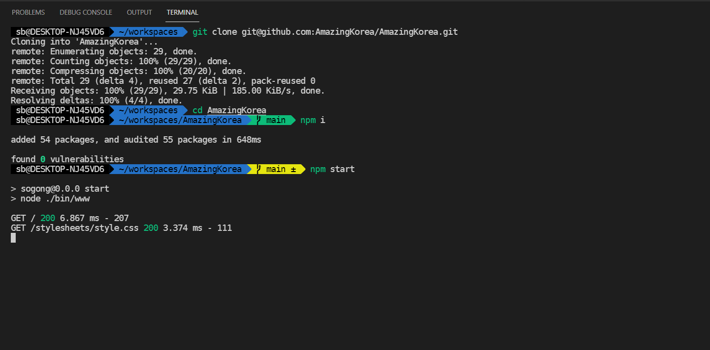
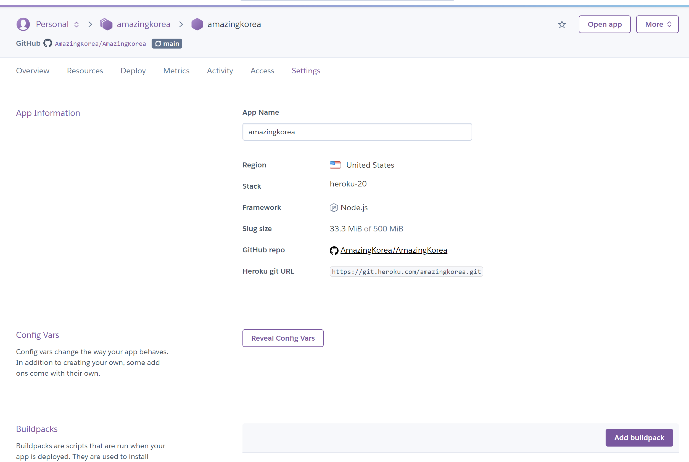

# AmazingKorea

## Live Demo: [Link](https://amazingkorea.herokuapp.com/)

## 개발환경 설치

1. [nodejs 설치](https://nodejs.org/en/) - 최신 버전이면 상관 없음.

- NPM도 설치됨.

2. [VSCode 설치](https://code.visualstudio.com/) - 사이트 최신 버전이면 상관 없음.

3. 이 레포 클론하기 ( git@github.com:AmazingKorea/AmazingKorea.git ) - 아래 명령어는 해당 폴더에서 실행해야 함.

## 애플리케이션 실행

```bash
$ npm i

$ npm start

# 이후 localhost:3000 으로 접속
```




## 배포 자동화

`main` 브랜치에 병합되는 경우 Heroku를 사용한 기초적인 배포를 수행한다.



## 협업 방법: GitHub Flow

GitHub Flow 문서 참조.
