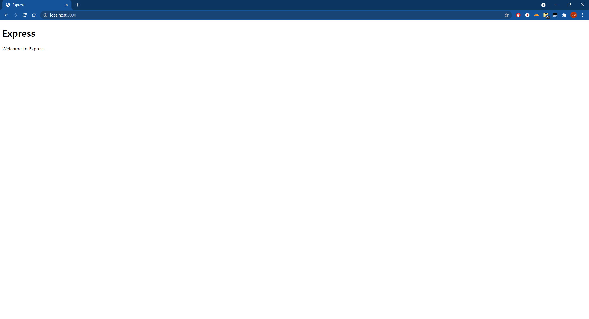

# AmazingKorea-Back

## 개발환경 설치

1. [nodejs 설치](https://nodejs.org/en/) - 최신 버전이면 상관 없음.

  - NPM도 설치됨.

2. [VSCode 설치](https://code.visualstudio.com/) - 사이트 최신 버전이면 상관 없음.

3. 이 레포 클론하기 ( git@github.com:AmazingKorea/AmazingKorea.git ) - 아래 명령어는 해당 폴더에서 실행해야 함.

## HOW TO RUN

```bash
$ npm i

$ npm start

# 이후 localhost:3000 으로 접속
```


